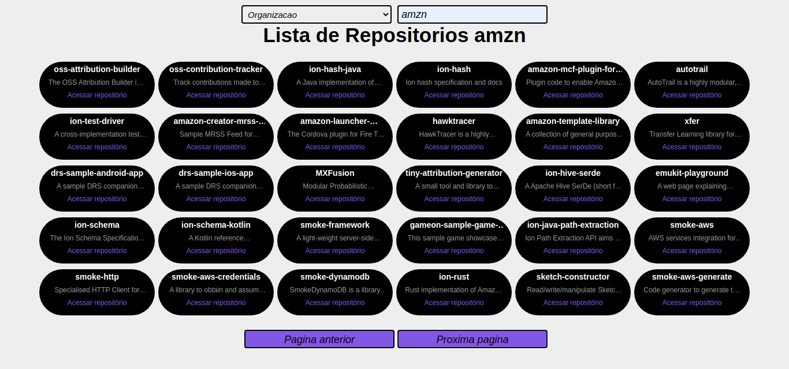
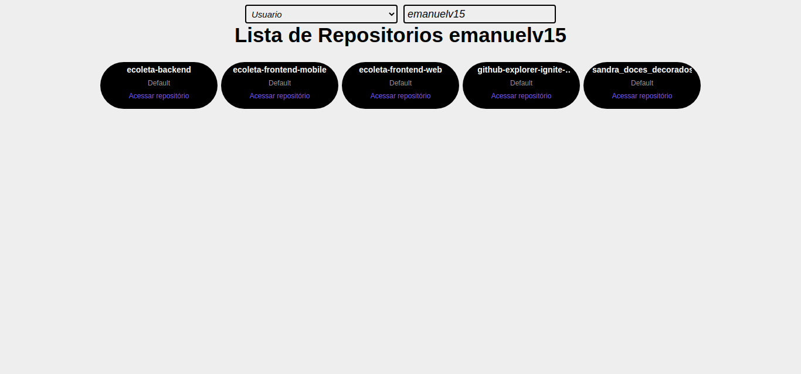
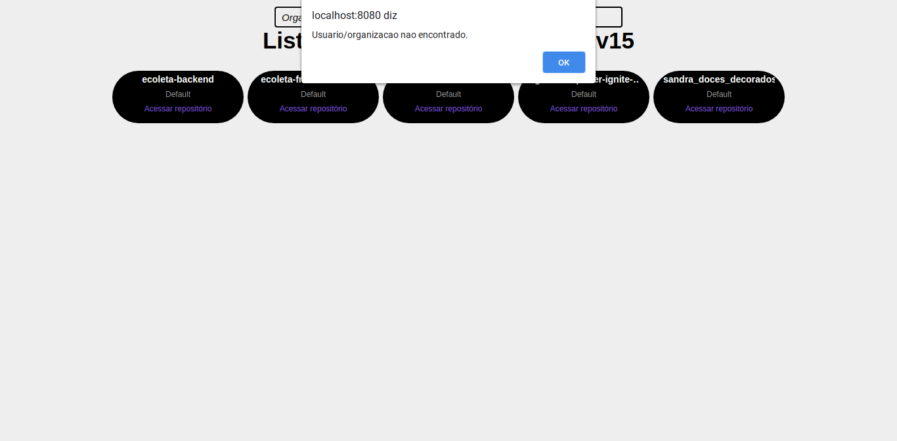
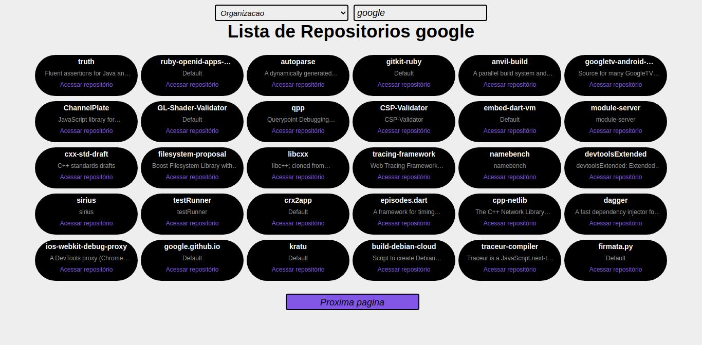

<h1 align="center">
  Github Explorer
</h1>

Module 01, Ignite React course by Rocketseat.

  

## 📜 Features

<ul>
  <li>
Using the Github api to search all repositories for a specific user or organization..
</li>
</ul>

  
  
  
  

## 🧰 Techs

[//]: # "Add the features of your project here:"

🔷 **React;**
🔷 **Babel;**
🔷 **Webpack;**
🔷 **Sass;**
🔷 **Typescript.**

## 💻 Getting started

1. Clone this repo using <code>https://github.com/emanuelv15/github-explorer-ignite-rocketseat.git</code>
2. Move to the appropiate directory: <code>cd directory</code>
3. Run <code>yarn</code> or <code>npm install</code> to install the dependencies
4. Run <code>yarn dev</code> or <code>npm dev</code> to start the development server

## 🤓 How to contribute

<ul>
  <li>Fork this repository;</li>
  <li>Create a branch with your feature: <code>git checkout -b my-feature</code>;</li>
  <li>Commit your changes: <code>git commit -m 'feat: My new feature'</code>;</li>
  <li>Push to your branch: <code>git push origin my-feature</code>.</li>
</ul>

After the merge of your pull request is done, you can delete your branch.

## License

This project is licensed under the MIT License - see the [LICENSE](https://opensource.org/licenses/MIT) page for details.

<a href="http://github.com/sartero">Emanuel Vitor Souza</a>
